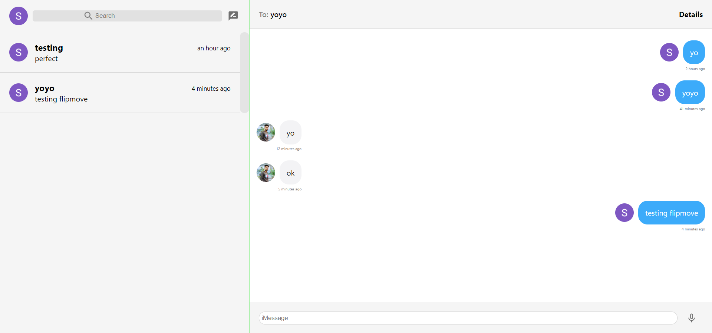

# iMessage Clone With Redux

A web app to represent the iMessage Clone build with React, Redux, Google Auth, Firebase and Material UI.

This is motivated and learned from [Clever Programmer](https://www.youtube.com/channel/UCqrILQNl5Ed9Dz6CGMyvMTQ).

## Tech Stack

- ReactJS, React Hooks, Redux, Google Auth, Firebase, Material UI

## Screenshot of the Web App

## Getting Started

- Fork and clone this repository
- Setup firebase and google auth
- Run `yarn && yarn start` or `npm i && npm start`
